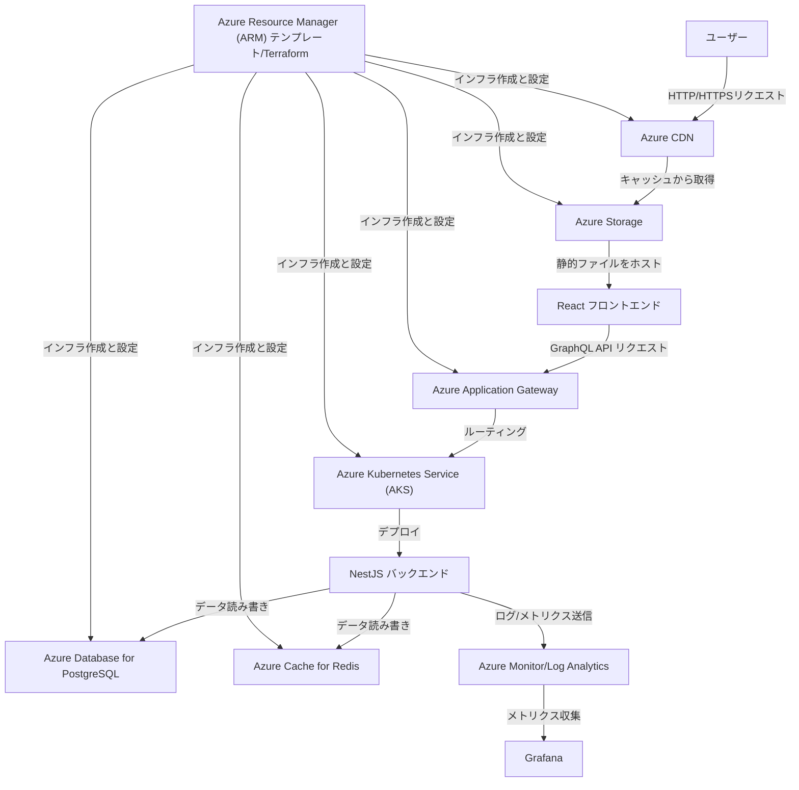

# 簡易構成図

```mermaid
graph TD;
    A[ユーザー] -->|HTTP/HTTPSリクエスト| B[Azure CDN]
    B -->|キャッシュから取得| C[Azure Storage]
    C -->|静的ファイルをホスト| D[React フロントエンド]

    D -->|GraphQL API リクエスト| E[Azure Application Gateway]
    E -->|ルーティング| F["Azure Kubernetes Service (AKS)"]
    F -->|デプロイ| G[NestJS バックエンド]
    
    G -->|データ読み書き| H[Azure Database for PostgreSQL]
    G -->|データ読み書き| I[Azure Cache for Redis]
    G -->|ログ/メトリクス送信| J[Azure Monitor/Log Analytics]

    J -->|メトリクス収集| K[Grafana]

    L["Azure Resource Manager (ARM) テンプレート/Terraform"] -->|インフラ作成と設定| F
    L -->|インフラ作成と設定| H
    L -->|インフラ作成と設定| I
    L -->|インフラ作成と設定| C
    L -->|インフラ作成と設定| B
    L -->|インフラ作成と設定| E
```
