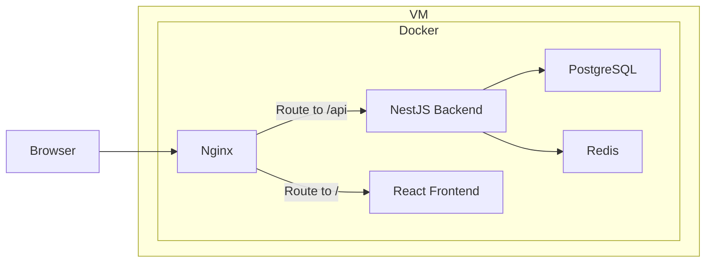

# 使い方

## セットアップ

1. `make setup`
2. ディレクトリ内の全ての.env の点検

   特に手動で編集する必要があるのは以下です。

   - `./.env`
     - `API_BASE_URL`: デプロイ先のスキーム+ホスト名
     - `VITE_MAPS_API_KEY`: Google Maps API の API key
     - `VITE_GA4_MEASUREMENT_ID`: Google Analytics 4 の Measurement ID
   - `./nginx/.env`
     - `SERVER_NAME`: デプロイ先のホスト名
   - `./.app/.env`
     - email settings 系

3. `make build`
4. `make seed-up`
   初回起動時のみ。DB の初期化とサンプルデータの投入を行います。

## 起動

`make up`

(非デーモンとして起動する場合は`make up-verbose`)

## 停止

`make down`

(Volume ごと削除する場合は`make destroy`)

# Figure

本 compose project の構成は以下のようになっています。

