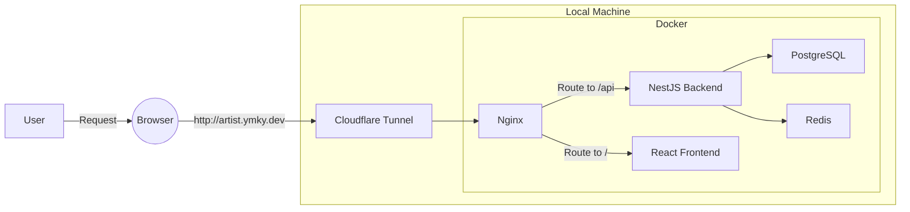

# セットアップ

TODO

# Figure

```mermaid
graph LR

A[User] -->|Request| B((Browser))
B -->|http://artist.ymky.dev| C[Cloudflare Tunnel]

subgraph LocalMachine[Local Machine]
    C --> D[Nginx]

    subgraph Docker[Docker]
        D -->|Route to /api| E[NestJS Backend]
        D -->|Route to /| F[React Frontend]

        E --> G[PostgreSQL]
        E --> H[Redis]
    end
end

```
