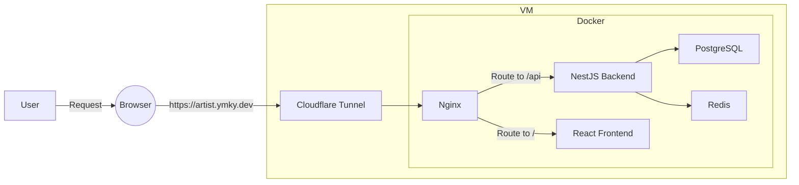

# 使い方

## セットアップ

`make setup`

## 起動

`make up`

(非デーモンとして起動する場合は`make up-verbose`)

# Figure

```mermaid
graph LR

A[User] -->|Request| B((Browser))
B -->|https://artist.ymky.dev| C[Cloudflare Tunnel]

subgraph VM[VM]
    C --> D[Nginx]

    subgraph Docker[Docker]
        D -->|Route to /api| E[NestJS Backend]
        D -->|Route to /| F[React Frontend]

        E --> G[PostgreSQL]
        E --> H[Redis]
    end
end

```
